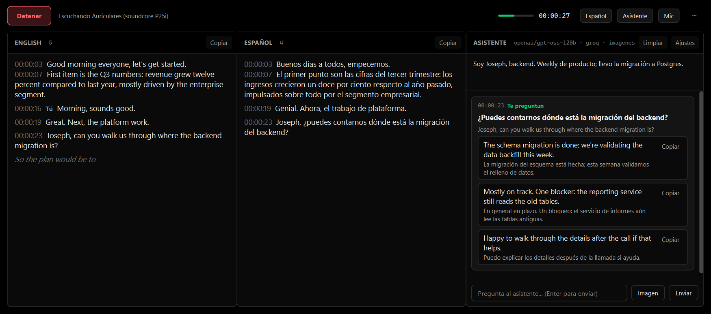

<div align="center">

# Live Captions

**Follow an English meeting in real time — transcript, Spanish translation and a copilot that drafts your answers.**

[](https://www.python.org/)
[](https://doc.qt.io/qtforpython-6/)
[](https://developer.nvidia.com/cuda-toolkit)
[](#)
[](#building-from-source)



</div>

---

## What it is for

Meetings in English move faster than a second language does. A word slips past, the question
was for you, and by the time you have rebuilt the sentence in your head the moment is gone.

Live Captions listens to **what your computer is playing** — Teams, Meet, Zoom, a recording,
anything — and writes it down as it happens. Next to it, each sentence in Spanish. And when
someone asks you something, a third panel drafts two or three ways to answer, in English,
ready to read out.

Nothing has to be installed on the meeting side and nobody knows it is running.

## What you see

Three panels, each of which can be hidden from the toolbar:

| Panel | What it shows |
| :--- | :--- |
| **English** | The live transcript. A grey draft appears while the person is still talking and is replaced by the final sentence when they pause. Your own words, if the microphone is on, are marked `Tú`. |
| **Español** | Every sentence the others said, translated a couple of seconds later. |
| **Asistente** | Suggested answers when a question is aimed at you, plus a chat for anything else about the conversation. |

The toolbar has the **Escuchar / Detener** button, the status line, an audio level, a clock,
toggles for the two optional panels and the microphone, and a `⋯` menu with clear, open the
sessions folder, always on top and the assistant settings.

Everything is written to disk as it happens — `~/Documents/LiveCaptions/<date>.en.md`,
`.es.md` and `.assistant.md`, one timestamped line per sentence — so a crash mid-meeting
loses nothing.

## How it hears

Windows exposes every output device as a **WASAPI loopback** input, so the app reads what is
going to your headphones without virtual cables or changing the default device. A second
capture, optional, takes the microphone so the assistant knows what you answered.

Both streams go through the same path: resampled to 16 kHz, split into sentences by Silero
VAD (0.6 s of silence closes one; 15 s forces a cut at the last pause), transcribed by Whisper.
Only one thread touches the GPU, so the two sources never fight over it.

```
loopback ─┐
          ├─> 16 kHz ─> Silero VAD ─> sentence ─> Whisper large-v3-turbo ─> English panel + .en.md
mic ──────┘                 │                            │
                            └── draft every ~1 s ────────┤──> opus-mt ──> Spanish panel + .es.md
                                                         └──> question filter ──> LLM ──> answers
```

Measured on an RTX 4060 Laptop: about **0.3 s** to transcribe a sentence and under **0.25 s**
to translate it. Whisper's usual inventions over silence ("Thank you for watching") are
filtered out.

## The assistant

A cheap filter lets through only sentences that look like a question or a request — a
question mark, an interrogative opening, "your thoughts", "walk us through", or any word of
your name, however Whisper spelled it. The model then gets the context you typed (who you
are, what the meeting is about, what you would rather not commit to), the last forty lines of
transcript, and decides whether the question is actually for you. If it is, a card appears
with the question in Spanish and two or three answers that differ in stance: direct,
cautious, ask for clarification. Each has a Spanish gloss and a copy button.

If several questions arrive in a row, only the latest is answered — the others have already
passed.

**Images as context.** Paste a screenshot (Ctrl+V) or attach a file — a slide, a diagram, an
email — say what it is, and a vision model reads it once: text transcribed, numbers, tables,
chart trends. That reading stays in the context, so from then on both suggestions and chat
know what was in it. The text model never sees the image, only the reading, so it stays fast.

**Any OpenAI-compatible API.** It ships configured for **Groq** on its free tier
(`openai/gpt-oss-120b` for text, `qwen/qwen3.6-27b` for images) and has presets for
Cerebras, NVIDIA NIM, OpenRouter and a local `llama-server`. The settings dialog asks the
provider for its current model list, so a retired model is a dropdown away from being
replaced. The API key is stored in the Windows Credential Manager, never in a file.

With a cloud provider, the recent transcript leaves your machine on every query. For a
confidential meeting use the local preset or hide the panel; transcription and translation
never leave the GPU either way.

## Models

Downloaded from Hugging Face on first run and cached in `~/.cache/huggingface`.

| Task | Model | Size |
| :--- | :--- | ---: |
| Transcription | `deepdml/faster-whisper-large-v3-turbo-ct2` | 1.6 GB |
| Translation EN→ES | `michaelfeil/ct2fast-opus-mt-en-es` (Helsinki-NLP opus-mt) | 150 MB |
| Voice activity | Silero VAD (bundled with faster-whisper) | – |
| Assistant | Groq `openai/gpt-oss-120b`, or any OpenAI-compatible endpoint | cloud |
| Images | Groq `qwen/qwen3.6-27b` | cloud |

The `⋯` menu shows which backend Whisper picked: `● cuda/float16` on an NVIDIA GPU, or
`○ cpu/int8` without one — it works, but not at conversation speed.

## Dependencies

| Package | Version | What it does |
| :--- | :--- | :--- |
| [PySide6](https://doc.qt.io/qtforpython-6/) | 6.11.2 | The window and the widgets |
| [faster-whisper](https://github.com/SYSTRAN/faster-whisper) | 1.2.1 | Whisper on CTranslate2, plus Silero VAD |
| [CTranslate2](https://github.com/OpenNMT/CTranslate2) | 4.8.2 | Inference engine for Whisper and opus-mt, CUDA backend |
| [PyAudioWPatch](https://github.com/s0d3s/PyAudioWPatch) | 0.2.12.8 | PortAudio with WASAPI loopback |
| [python-soxr](https://github.com/dofuuz/python-soxr) | 1.1.0 | Streaming resampler to 16 kHz |
| [SentencePiece](https://github.com/google/sentencepiece) | 0.2.2 | Tokenizer for the translation model |
| [httpx](https://www.python-httpx.org/) | 0.28.1 | The chat completions client, streaming included |
| [keyring](https://github.com/jaraco/keyring) | 25.7.0 | API key in the Windows Credential Manager |
| `nvidia-cublas-cu12` / `nvidia-cudnn-cu12` | 12.9 / 9.26 | CUDA libraries; no toolkit install needed |

## Building from source

Windows 10/11, Python 3.12 and [uv](https://docs.astral.sh/uv/). For the GPU path, a recent
NVIDIA driver is enough — the CUDA DLLs come with the wheels.

```bash
uv sync
uv run python -m live_captions      # run it
uv run pytest                       # 26 tests: sentence splitting, storage, detector, client
uv run python tools/build.py        # dist/LiveCaptions/, then copied to ~/Documents/DevTools/LiveCaptions
```

The build is a PyInstaller folder of about 1.5 GB, almost all of it CUDA (`cublasLt64_12.dll`
alone is 638 MB); three cuDNN libraries Whisper never touches are left out. The icon is drawn
in code (`src/live_captions/icon.py`) and `tools/make_ico.py` turns it into the multi-size
`.ico` the executable embeds, so the window, the taskbar and Explorer all show the same one.

To check a packaged build without opening the window:

```bash
LiveCaptions.exe --selftest report.json
```

It loads both models, transcribes a second of silence, translates a sentence, finds the
loopback device and confirms the credential store — and writes the result as JSON.
